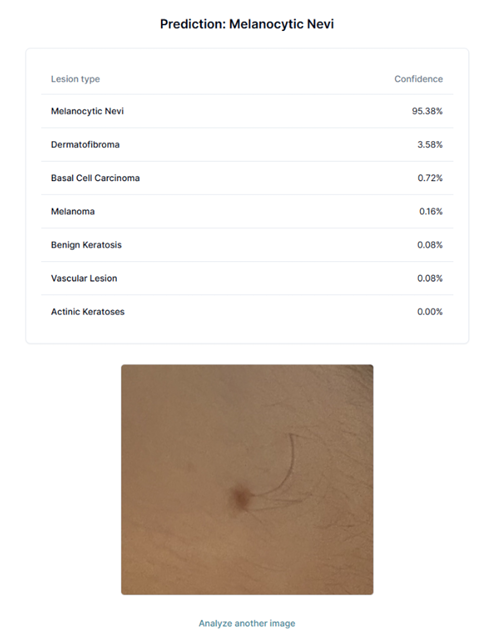
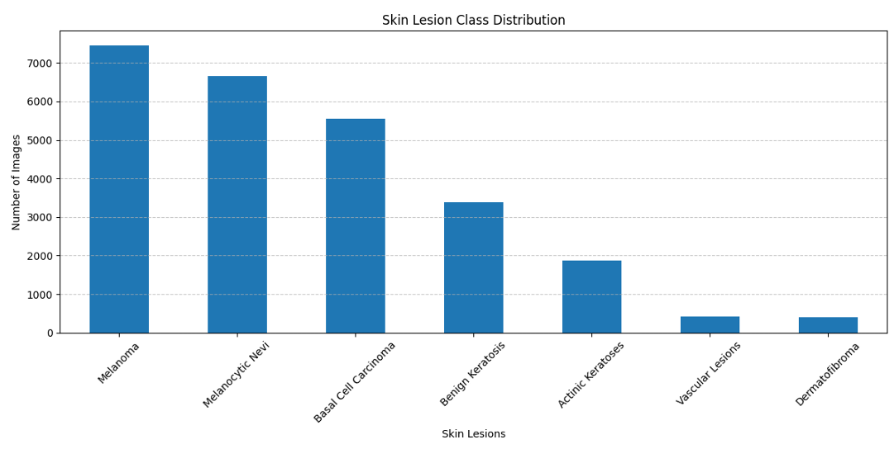

# 🔬 DermaScope AI  

  
  
  
  
  
  
  
  
 

AI-powered skin cancer diagnosis platform endorsed by the University of Toronto Faculty Dean.  
This project combines deep learning (AI/ML), scalable data pipelines, and full-stack deployment to provide real-time predictions of dermoscopic images.  

---

## 🎯 Overview  
- **Timeline:** Apr 2025 – Aug 2025  
- **Role:** Freelance Software Engineer  
- **Impact:** Delivered a robust diagnosis tool with **92% test accuracy** and predictions in **<8 seconds**, accessible via a user-friendly web interface.  

---

## 🧠 Technical Highlights  
- **Deep Learning Pipeline**:  
  - Leveraged **EfficientNet-B3 transfer learning** via PyTorch for feature extraction & classification.  
  - Trained on **50,000+ augmented dermoscopic samples** (sourced via Kaggle, ISCIC and augmentations) across **7 major skin cancer types**.  

- **Data Processing & Architecture**:  
  - Built a scalable system with **Python, NumPy, Pandas, and OpenCV** for preprocessing and augmentation.  
  - Designed & tuned classifier architecture for performance and generalization.  

- **Full-Stack Platform**:  
  - Developed a responsive platform with **Flask REST API (backend)**, **React (frontend)**, and **Supabase (cloud database & auth)**.  
  - Achieved real-time predictions with **<8s latency** for uploaded images.  

---

## 📊 Results  

| Metric              | Value        |
|----------------------|-------------:|
| Test Accuracy        | **92%**      |
| Classes              | 7 Skin Cancer Types |
| Dataset Size         | 50,000+ Augmented Images |
| Inference Latency    | <8s per image |

📸  

---

## 🎥 Demo  

- 🌐 **Live Demo:** [dermascopeai.vercel.app](https://dermascopeai.vercel.app/)  
- 🎓 **Dean Endorsement:** [Instagram Post](https://www.instagram.com/p/DOPf85Bicfz/?igsh=MTRkOHNoM3FsZngzYQ==)  
- 📽️

# 📊 Results & Visuals  

## 🖼️ Example Prediction  
Demonstration of the model classifying a dermoscopic image with confidence scores across 7 lesion types.  

  

---

## 📈 Dataset Distribution  
Two class distribution views:  
- **Balanced distribution** after augmentation (~7k images per class).  
- **Original distribution** before augmentation (imbalanced dataset).  

| Balanced Dataset | Original Dataset |
|------------------|------------------|
|  |  |

---

## 📉 Model Performance  
Evaluation metrics and training curves.  

**Final Metrics:**  
- Test Accuracy: **90.17%**  
- Test Error: **9.83%**  
- Test Loss: **0.4252**  
- Max Validation Accuracy: **90.39%**  
- Min Validation Loss: **0.3635**  

  

---

## 🧠 Model Architecture (Simplified)  
High-level visualization of the classification pipeline.  

  
